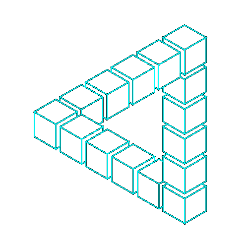

<h1 align="center">Hi 👋, I'm Yashwant Kargwal</h1>

  

<!--<h3 align="center">Full Stack Developer | React & NestJs | Exploring AI & LLM</h3> -->

  

  

- 🔭 I’m currently working on **RupeeEmpire**,

<!-- - 👯 I’m looking to collaborate on [QuickCSS Documentations](https://quickcss-docs.hashnode.space/guide/welcome) -->

- 🌱 I’m currently learning **Advanced System Design** and **Python**

- 💬 Ask me about **Web Development** and **App Development**

- 📫 How to reach me **vexcoder.yt@gmail.com**

<h3 align="left">Connect with me:</h3>

<h3 align="left">Languages and Tools:</h3>

                 

## 🌌 Contribution Graph

