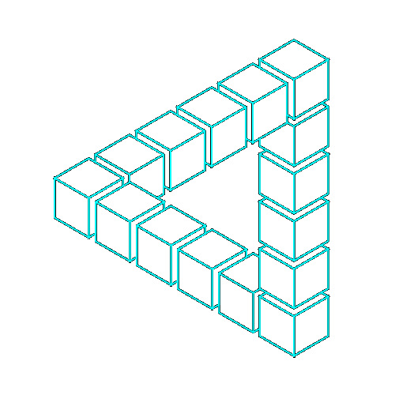

<h1 align="center">Hi 👋, I'm Yashwant Kargwal</h1>
<h3 align="center">Frontend Developer | React & TypeScript | Exploring AI & Full Stack</h3>

  

  

- 🔭 I’m currently working on **RupeeEmpire**,

<!-- - 👯 I’m looking to collaborate on [QuickCSS Documentations](https://quickcss-docs.hashnode.space/guide/welcome) -->

- 🌱 I’m currently learning **NodeJs** and **Python**

- 💬 Ask me about **Web Development** and **App Development**

- 📫 How to reach me **yashwantkargwal9@gmail.com**

<h3 align="left">Connect with me:</h3>

<h3 align="left">Languages and Tools:</h3>

           

<!-- 

 -->

<!-- 

 -->

